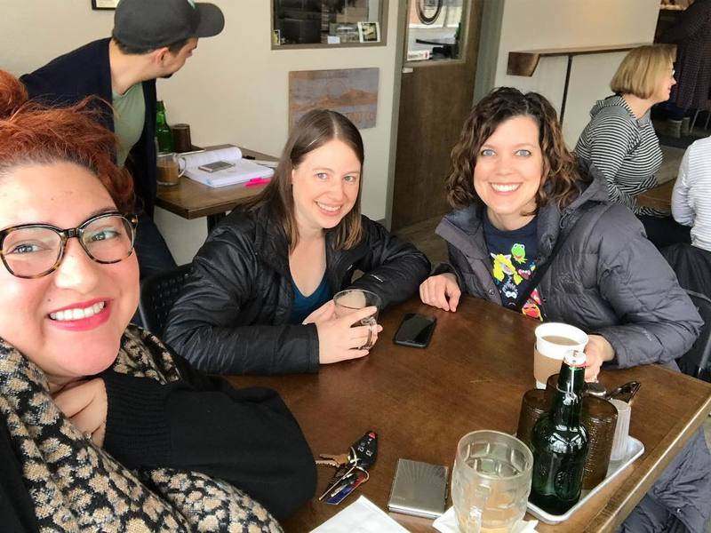
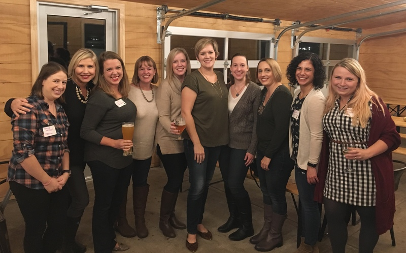

## About Us

{: .left}

Mothers' Center of Champaign County is designed to support moms holistically as
they navigate motherhood and the many other aspects of their lives and
identities. While there are classes, articles, registries, and showers to help
moms get ready for baby, there are few resources to help them with the
emotional and intellectual impact of motherhood. Amid the thousands of articles
telling you what to buy for your baby and how to get ready for baby, no one
tells you that what you really need is a friend to guide and support you.
Mothers' Center provides the emotional support, practical wisdom, and helping
hands needed to thrive as a mother and as an individual. This is particularly
important in a transient community like Champaign-Urbana, where so many of us
live far from family and friends. 

We set ourselves apart from other moms groups by focusing on inclusivity and
welcoming moms of all backgrounds, including: moms-to-be and moms with children
of all ages; and working moms, stay-at-home moms, and work-from-home moms. As
such, we are not associated with any religious organization, and hold events
during the day, in the evening, and on weekends. 

## Mission and History

Our mission is to be the Champaign-Urbana area's premier moms group focused on
the friendship and care of mothers. We started in 2000 as a chapter of Mothers
& More. In 2016, upon the closing of the national organization of Mothers &
More, we became Mothers' Center of Champaign County, and in 2017 became our own
independent 501(c)7 non-profit social group. Being a member is extremely
rewarding for various reasons, but primarily because motherhood is a
challenging journey made easier with the support of other moms.

## Board of Directors 2018

{: .right style="width: 400px;"}

 * Kelly Hoene, _President_
 * Meghan Kirkpatrick, _Secretary_
 * Rachel Dimock, _Treasurer_
 * Krista Rodgers, _Membership Coordinator_
 * Erin Ewoldt, _Marketing Coordinator_
 * Andrea Miller, _Moms-Helping-Moms Coordinator_
 * Alyssa Buckley, _Social Committee_
 * Allison Whitney, _Social Committee_
 * Kadriye Hieronymi, _Playgroup Committee_
 * Jacqueline Kronlund, _Playgroup Committee_
