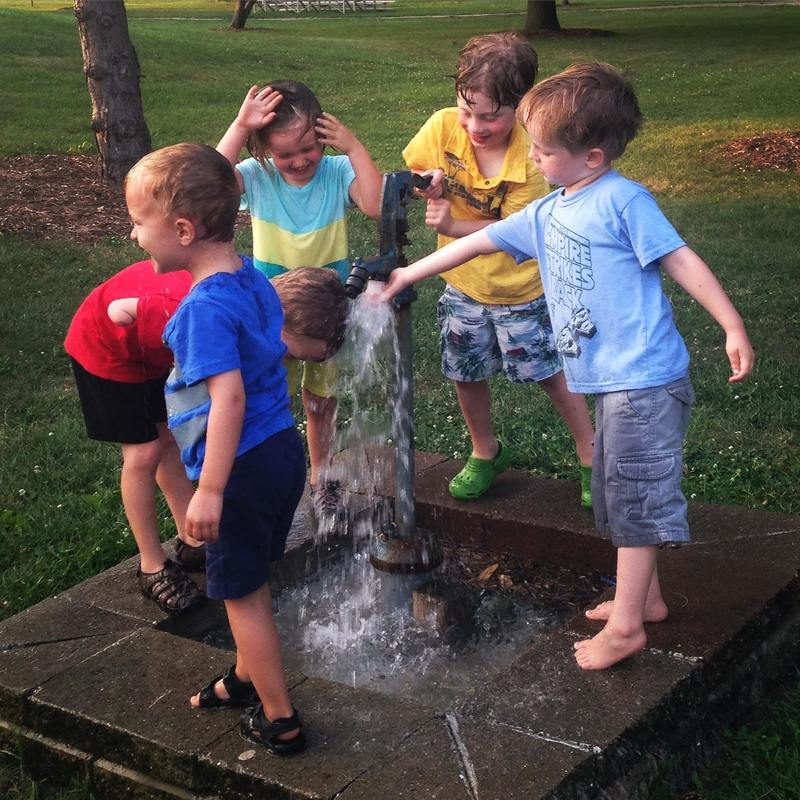
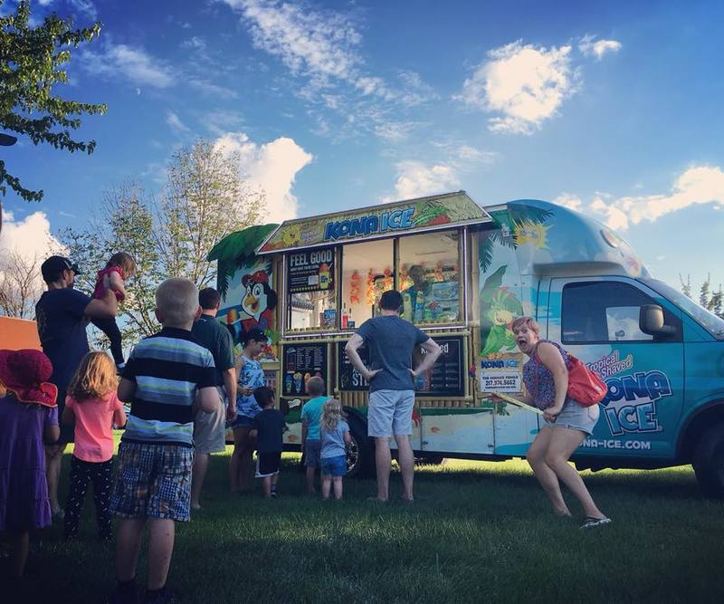

Mothers' Center members enjoy a full calendar with moms-only social events,
playgroups, family meet-ups, and community service opportunities!

Non-members are invited to <b>two</b> free events before they
<a href="https://goo.gl/forms/ncpTYh6j67qUXPEG3" style="color: #6257aa;"><button class="highlight" style="font-size: 125%;">Sign up!</button></a>

## Social Events

{: .right}

Moms-only social events allow us to step away from our child rearing and work
responsibilities, relax, remember who we are as individuals, and build strong
friendships. Each month, we host brunch, book club, tv club, moms' night out,
and bottle battle. In addition to our regular monthly activities, we plan
special events that match the interests of our members. Some popular events
have included game nights, pottery painting, cooking classes, glass blowing,
cookie exchange, favorite things party, and movie nights. It is amazing how
restorative an evening out with good friends can be! 

## Playgroups

{: .left}

The old parenting adage, "The days are long, but the years are short," could
not be more true. To help you through some of those long days, we have regular
playgroups. We meet up at members' homes, as well as family-friendly public
spaces, such as local parks, indoor playgrounds, libraries, and the YMCA.
Events are held during the day, as well as in the evenings and on weekends, so
working moms can join in the fun too. Life is better with friends; come play
with us!

&nbsp;

{: .right}

## Family Meet-Ups

While Mothers' Center is focused on the friendship and care of moms, we don't
leave the dads out entirely. Each summer we have a potluck picnic for all
members, partners, and kids. In addition, we plan special family meet-ups, such
as our Father's Day celebration at Riggs Beer Company.   

## Community Engagement

Mother's Center prides itself not only on being a great support for moms, but
also on helping out ALL members of the local community. Past Mothers' Center
service projects include making blessing bags (toiletries & snacks) to hand out
to homeless individuals, a children's book drive, and a diaper drive. 

We are always looking for organizations to partner with for our service projects! If you are an organization interested in partnering with us, please <a href="mailto:motherscenterchampaign@gmail.com">contact us</a>.

